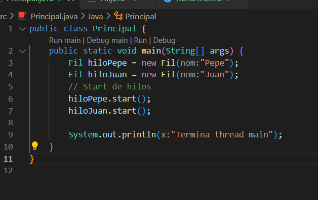
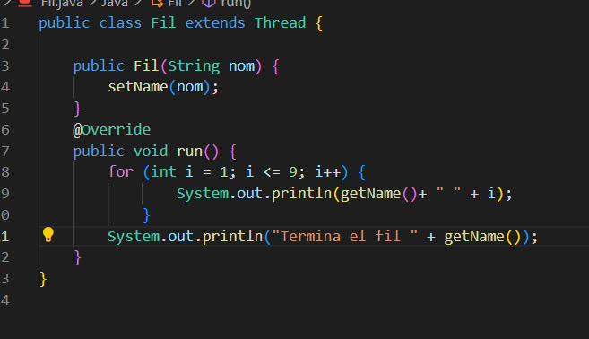
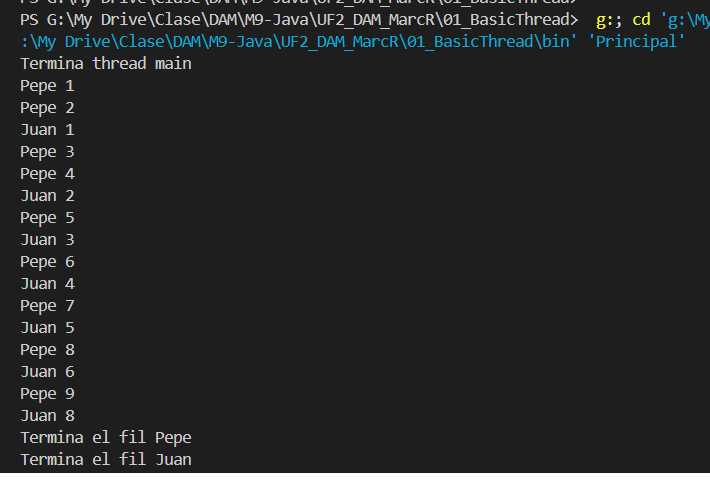
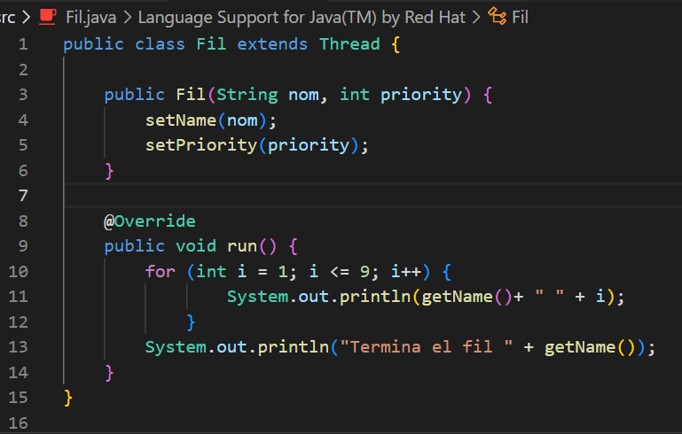
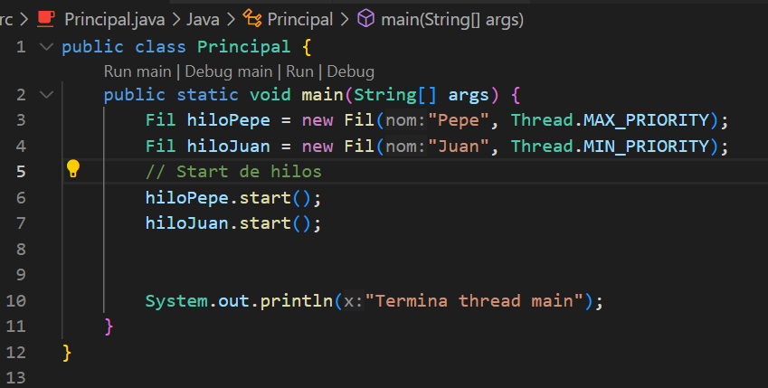
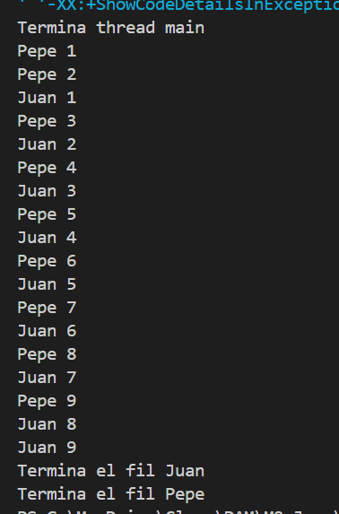
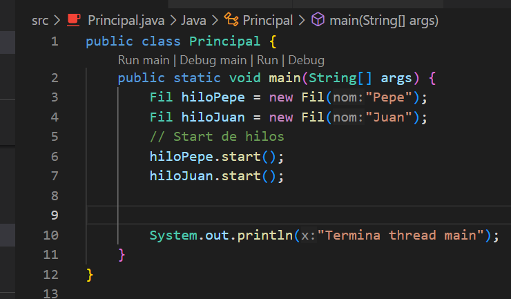
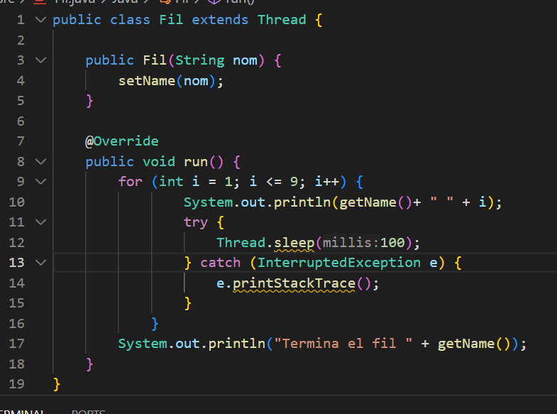
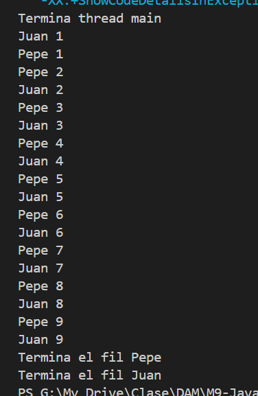

# README 

<h4>Comportamiento 1</h4>

Código principal.java

Código fil.java - Un simple bucle de 9 

Comportamiento resultado del primer apartado

<h4>Comportamiento 2</h4>

Primero muestro el Fil, al cual le he añadido la propiedad "priority" para priorizar y que haga antes un hilo al otro

Y en el principal, le envio las prioridades

Y el comportamiento, aunque he ejecutado muchas veces ya, no he conseguido que saque el mismo resultado que el del enunciado

<h4>Comportamiento 3</h4>

El principal vuelve a estar como en el principio, ya que lo que hare es dormir el hilo a cada iteración

El fil, el cual ponemos a dormir en cada tirada del bucle

Y el comportamiento

