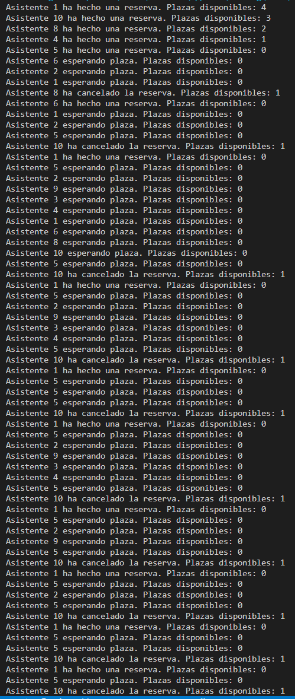
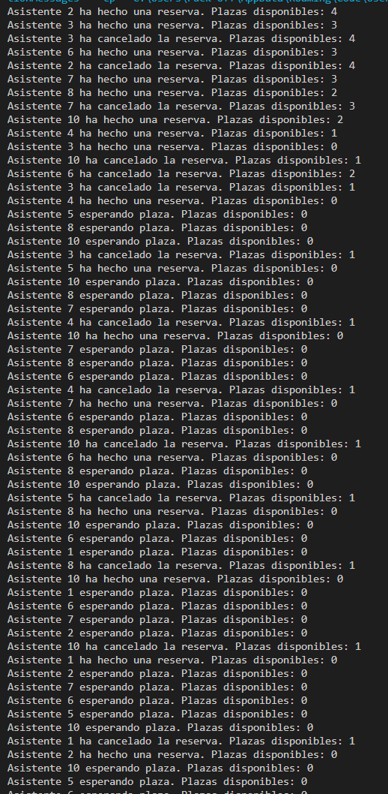

## Getting Started

1. Porque se termina parando la ejecución al cabo de un tiempo?

Cuando varios hilos acceden y modifican a una misma variable compartida, en este caso placesDisponibles, sin sincronizarlo, pueden ocurrir situaciones indeseadas debido a la falta de atomicidad, lo cual genera estados inconsistentes

2.

70-30

30-70

3. Porque crees que hace falta la lista y no sirve solamente con una variable entera de reservas?

Con una lista puedes identificar quien ha reservado, lo cual es util para mostrar los asistentes actuales, cancelar una reserva específica o evitar que el mismo asistente haga varias reservas. Si usamos un numero entero para las reservas, solamente podremos saber el numero de reservas que hay, pero no podremos extraer mas datos de esto